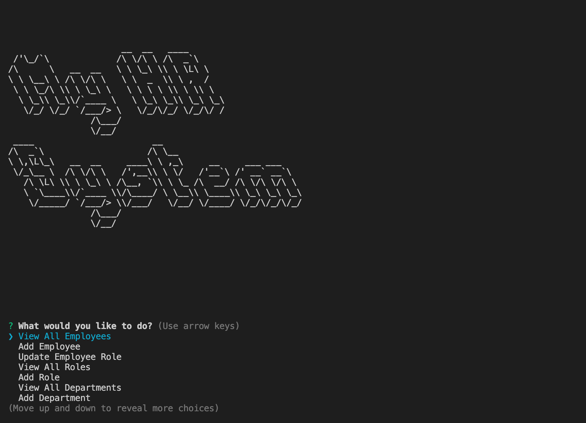
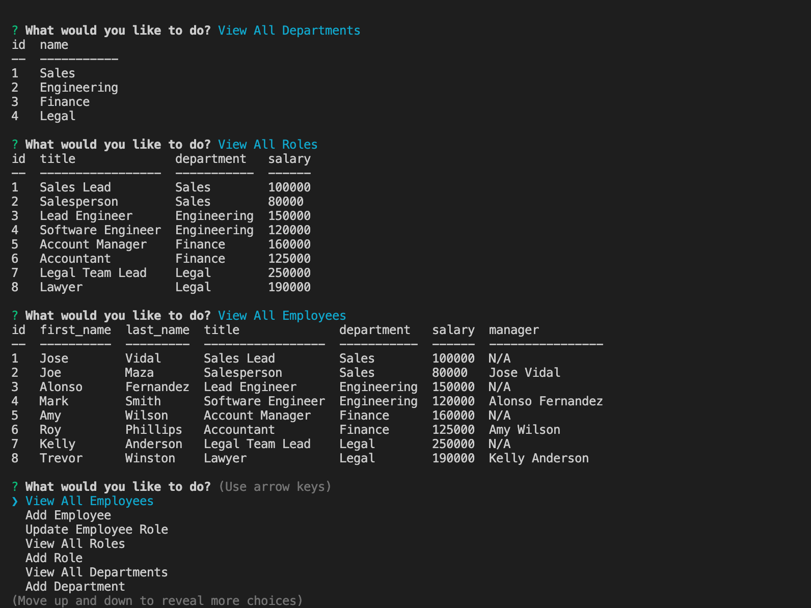
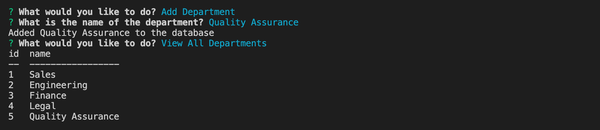
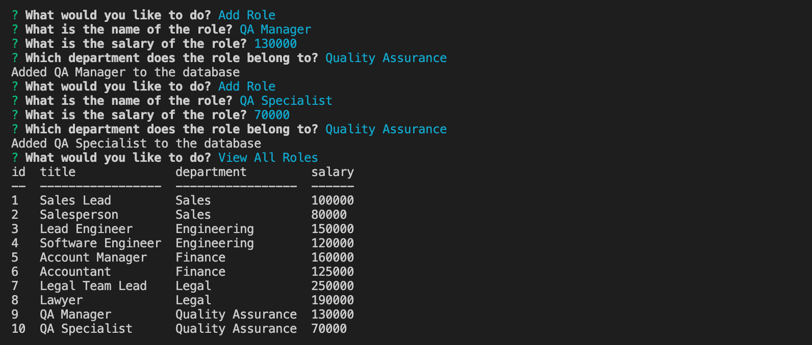
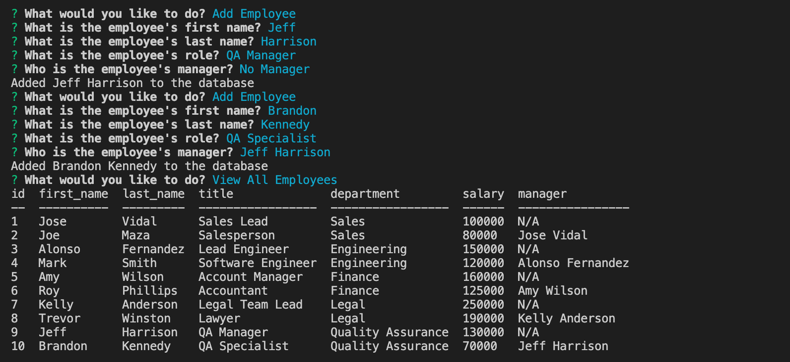
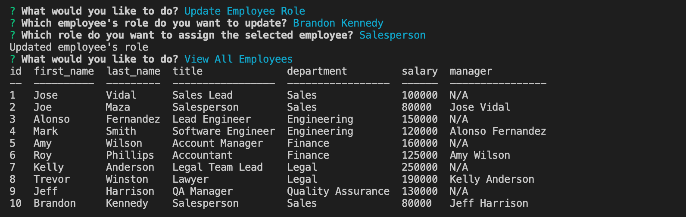

# u12-hw-sql-employee-tracker
ITESM Coding Bootcamp - Unit 12 Homework - SQL: Employee Tracker

## Description

This was a Job-Seeking coding assessment, where I was required to build a Node.js application to manage an employee database. It uses MySQL2 package to get connected to MySQL and make queries to obtain the necessary information from the database. The app also uses Inquirer package to prompt a series of questions, allowing the user to see all departments, roles and employees, as well as adding a new department, role (including salary and the department it belongs) and employee (with first name, last name, role title, department, salary and manager), or update an existing employee role. To show the database tables in the terminal, the application uses the console.table package. When initialized, the app shows a logo which is achieved using the Figlet package.

To make this Employee Tracker application, first I set up the file structure, with a root directory containing an Index.js and package.json (with the necessary Node.js packages). I also included a src directory (with connection.js file to create a connection to MySQL) and db directory (with schema.sql to create the hr_db and its tables, seeds.sql to populate the hr_db tables and query.js with a class and methods to make MySQL queries). 

After the file structure was done, I started writing code using `mysql.createConnection` with environment variables to establish the connection to MySQL. Following this, I added code in schema.sql and seeds.sql to create the hr_db, its tables and populate them with some departments, roles and employees information. 

Next, using Inquirer package, I added the code to index.js file to set all the questions that should be prompted in the CLI. I sectioned the questions into several functions (as variables with `const`), this to allow the application to make a continuous loop that always returns to the main `todoQuestion()` function to display the initial question (unless the user selects the 'quit' option to apply `process.exit()` and stop the application). This main function has a set of conditional `if` statements to call different functions that perform certain actions with specific MySQL queries (which are in the query.js file). I also added to the index.js file a `systemLogo()` function, using Figlet package, to display "My HR System" logo as soon as the application is initialized by an `init()` function when typing `node index.js` into the terminal.

Finally, in the query.js file I wrote the code to create a `class Query` with several methods that use MySQL2 `.promise()` function to make MySQL queries to be asynchronous. All these methods are called in index.js file in separate functions (some of them with certain parameters) that perform a certain action, like `viewAllDepartments()`, `viewAllRoles()`, `viewAllEmployees()`, `newDepartment()`, `newRole()`, `newEmployee()` and `updateEmployeeRole()`.

## Usage & [Walkthrough Video]()

To see the application in use watch this [Walkthrough Video]()

The application looks like this:

 

## Technologies Used

* JavaScript
* Object Oriented Programming
* Node.js
* MySQL
* NPM
* Inquirer package
* MySQL2 package
* Console.Table package
* Figlet package

## Contact Information

* GitHub Profile: [josevidmal](https://github.com/josevidmal)
* email: josevidmal@gmail.com

## License

[The MIT License](https://www.mit.edu/~amini/LICENSE.md)

Copyright 2022 Jose Vidal

Permission is hereby granted, free of charge, to any person obtaining a copy of this software and associated documentation files (the "Software"), to deal in the Software without restriction, including without limitation the rights to use, copy, modify, merge, publish, distribute, sublicense, and/or sell copies of the Software, and to permit persons to whom the Software is furnished to do so, subject to the following conditions:
    
The above copyright notice and this permission notice shall be included in all copies or substantial portions of the Software.
    
THE SOFTWARE IS PROVIDED "AS IS", WITHOUT WARRANTY OF ANY KIND, EXPRESS OR IMPLIED, INCLUDING BUT NOT LIMITED TO THE WARRANTIES OF MERCHANTABILITY, FITNESS FOR A PARTICULAR PURPOSE AND NONINFRINGEMENT. IN NO EVENT SHALL THE AUTHORS OR COPYRIGHT HOLDERS BE LIABLE FOR ANY CLAIM, DAMAGES OR OTHER LIABILITY, WHETHER IN AN ACTION OF CONTRACT, TORT OR OTHERWISE, ARISING FROM, OUT OF OR IN CONNECTION WITH THE SOFTWARE OR THE USE OR OTHER DEALINGS IN THE SOFTWARE.